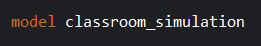
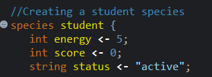
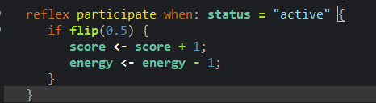
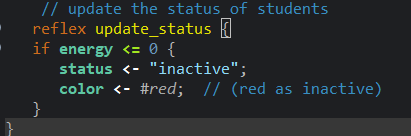
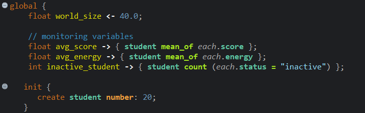
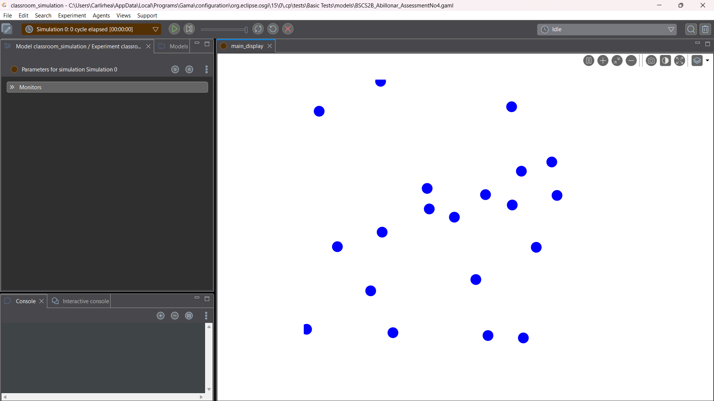
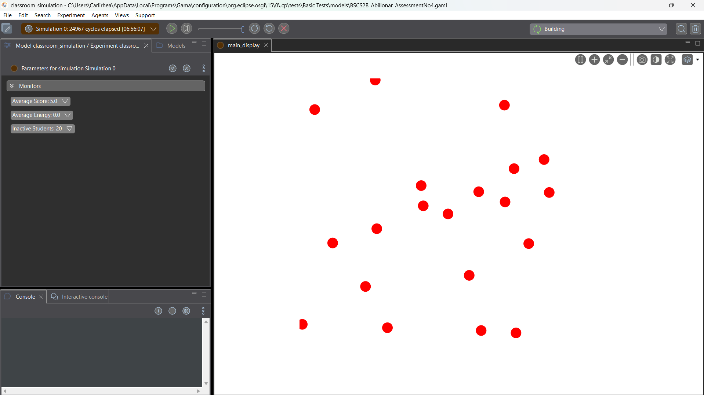

Part 1 – Simulation Scenario
You will create a simple classroom participation simulation. Each student agent has the following attributes:

Attribute Description energy ability of the student to participate score participation score status active or inactive Rules

Students may participate in class.
When participating: o score increases by 1 o energy decreases by 1
When energy reaches 0, the student becomes inactive.
Part 2 – Step 1: Create the Model
Create a new GAMA model. Example: model classroom_simulation 

Part 3 – Step 2: Define the Student Agent
Create a student species. Example: 
species student {
    int energy <- 5; 
    int score <- 0; 
    string status <- "active";

Part 4 – Step 3: Add Behavior (Participation)
Students randomly participate in class. Example: 
reflex participate when: status = "active" {
    if flip(0.4) { 
        score <- score + 1; 
        energy <- energy - 1;
    }
}
Explanation: • flip(0.4) means 40% chance of participation. 

Part 5 – Step 4: Add Reflex for Status Update
When energy becomes 0, change the status. 
    reflex update_status {
    if energy <= 0 { status <- "inactive";
    }
}

Part 6 – Step 5: Create the Environment
Add the global section. 
global {

    init { create student number: 20;
    }
}

Part 7 – Step 6: Run the Simulation

Observe the following: • • Which students participate the most - Students with higher energy levels participate the most because they can sustain activity for more cycles before reaching exhaustion. • How energy changes over time - Average energy decreases steadily over time, eventually dropping to 0.0 as shown in the monitors. • When students become inactive - Students become inactive when their energy level hits zero, which has occurred for all 20 students by the cycle takes longer.

Part 8 – Guide Questions

Answer the following questions.
1. What happens to students when energy reaches 0?
    When a student's energy level hits 0, they immediately stop all classroom activities. In the simulation, their visual color changes from blue (active) to red (inactive) so you can easily see who is no longer participating. They are then officially counted under the Inactive Students monitor.
2. How does participation affect score and energy?
    Participation is a trade-off. Every time a student chooses to participate, it helps raise the Average Score of the class. However, this action also costs energy. Therefore, the more active a student is, the faster their energy bar drops toward 0.0.

3. If participation probability increases to 0.8, what happens?
    Increasing the probability to 0.8 means students will choose to engage in activities much more often. Because they are participating more frequently, their energy will drain significantly faster than before. This leads to a quick spike in scores at the start, followed by a very early wave of students becoming inactive.

4. What pattern do you observe in the simulation?
    The simulation follows a clear energy-use pattern. It starts with a high level of activity where most students are blue and scores are rising. Over time, as energy is spent, there is a steady decline in participation until the entire population eventually turns red and becomes inactive.